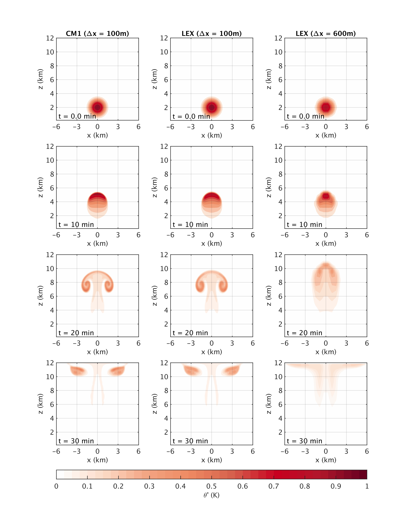
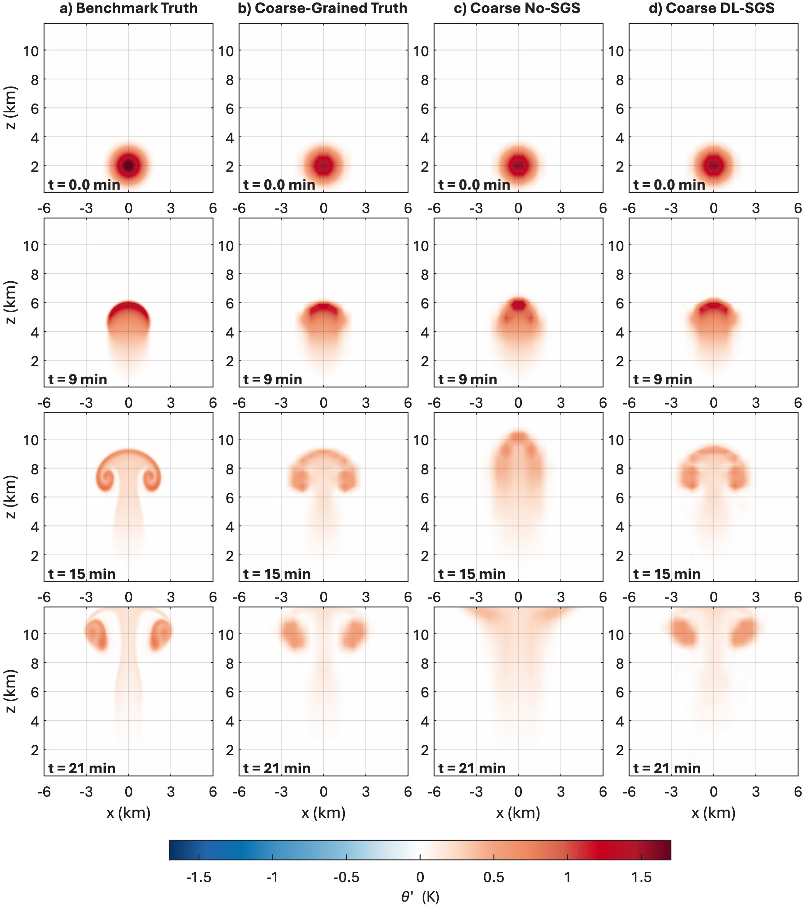

## LEX: Large-Eddy simulation in JAX

This is the LEX model website. LEX is a Large-Eddy simulation model written in JAX. It can be used for hybrid simulations combining machine learning and physics-based numerical simulations. 

LES has two dynamical cores. One adopts the pseudo-incompressible equations and the other have fully compressible equations. It uses the Weighted Essentially Nonoscillatory (WENO) schemes to calculate fluxes and a third-order Runge-Kutta (RK3) method to integrate in time. The following figure is our benchmark simulation of a simple warm bubble case. Its accuracy is the same as that of the fully compressible Cloud Model 1 (CM1) for this simple case.

If you run LEX without any deep learning component, you should use **lex_relay.py**. For running LEX with a deep learning SGS model, please use **lex_dl_relay.py**. Training the deep learning SGS model should use **lex_dl_train.py**. 

The figure below shows the deep learning SGS model's testing result. The benchmark simulation used 100-m grid spacing in all three direcitons. The coarse-resolution runs used 600-m horizontal grid spacing and 300-m vertical grid spacing.

