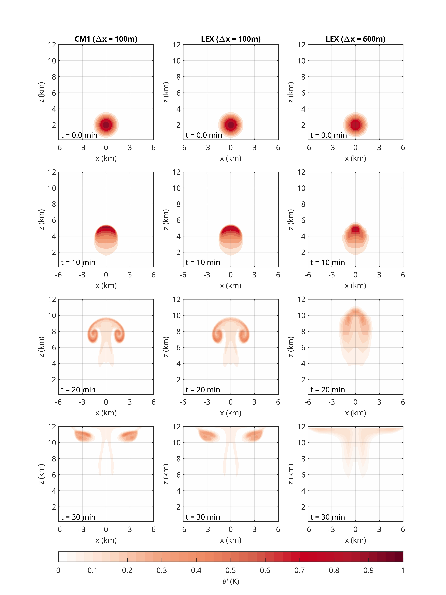

## LEX: Large-Eddy simulation in JAX

This is the LEX model website. LEX is a Large-Eddy simulation model written in JAX. It can be used for hybrid simulations combining machine learning and physics-based numerical simulations. 

LES used a pseudo-incompressible dynamical core. The following figure is our benchmark simulation of a simple warm bubble case. Its accuracy is close to the Cloud Model 1 (CM1) for this simple case.

